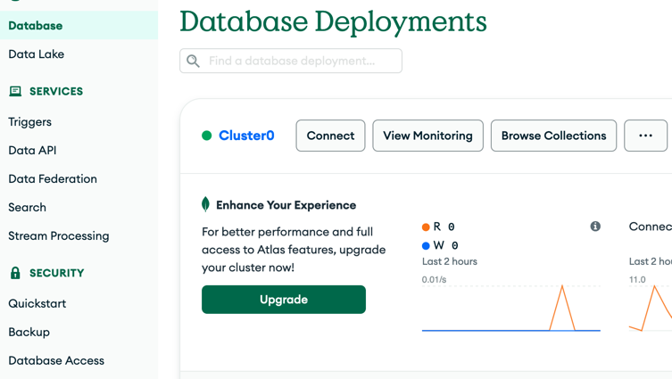

# Setup

1. Clone the back repository: 
    ```shell
    git clone https://github.com/Redshark61/Project-13-Bank-API.git
    ```

2. Clone the current front repository
3. Install dependencies for both repositories:
    ```shell
    npm install
    ```

## Back setup

1. Create the mongo database using the [mongodb website](https://www.mongodb.com/atlas).
2. Once done, click on the *connect* button and choose *Drivers*.

3. Finally, copy the connection string and paste it in the .env file of the back repository.
4. Run the back server:
    ```shell
    npm run dev:server
    ```

## Populate the database

1. Open a new shell, while the server is running.
2. Run the following command:
    ```shell
    npm run populate-db
    ```